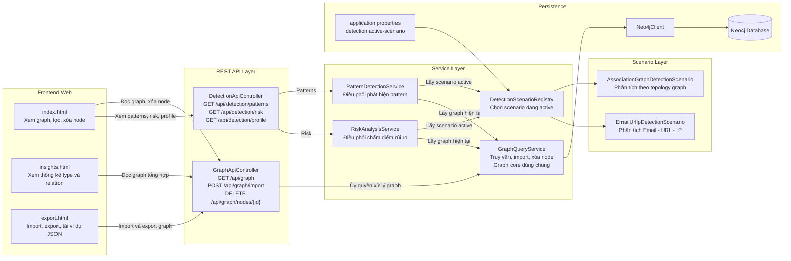
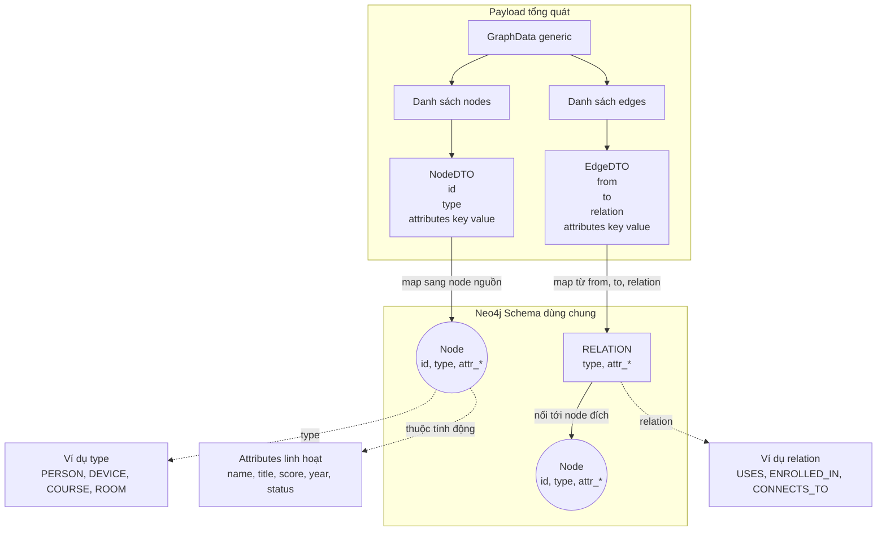
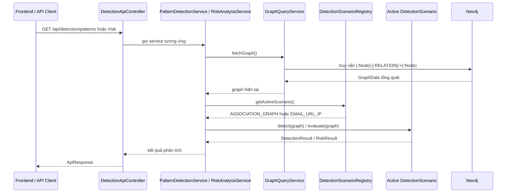
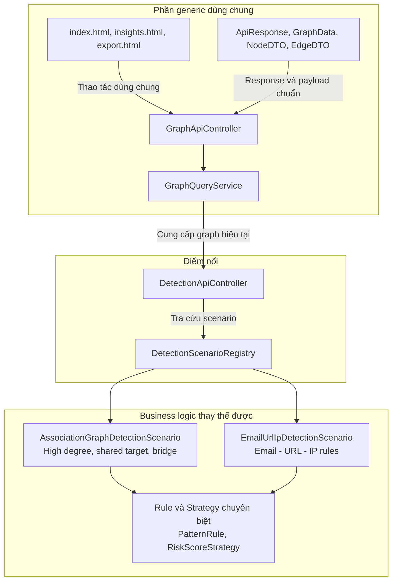
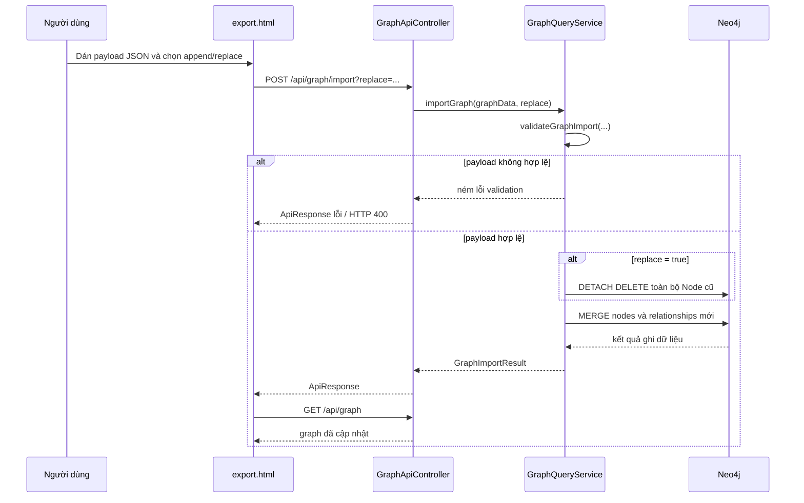
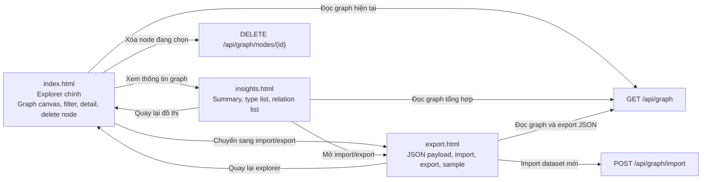

# BÌA CHÍNH

TRƯỜNG: [Bổ sung tên trường]

KHOA/ĐƠN VỊ: [Bổ sung tên khoa hoặc đơn vị]

BÁO CÁO TỔNG KẾT ĐỀ TÀI SINH VIÊN NGHIÊN CỨU KHOA HỌC

TÊN ĐỀ TÀI:

TỐI ƯU HÓA MÃ NGUỒN VÀ TĂNG TÍNH TÁI SỬ DỤNG TRONG HỆ THỐNG PHÂN TÍCH ĐỒ THỊ BẰNG KỸ THUẬT GENERICS

Sinh viên thực hiện: [Bổ sung]

Lớp: [Bổ sung]

Giảng viên hướng dẫn: [Bổ sung]

Địa điểm, thời gian: [Bổ sung]

---

# BÌA PHỤ

BÁO CÁO TỔNG KẾT ĐỀ TÀI SINH VIÊN NGHIÊN CỨU KHOA HỌC

TÊN ĐỀ TÀI:

TỐI ƯU HÓA MÃ NGUỒN VÀ TĂNG TÍNH TÁI SỬ DỤNG TRONG HỆ THỐNG PHÂN TÍCH ĐỒ THỊ BẰNG KỸ THUẬT GENERICS

Chủ nhiệm đề tài: [Bổ sung]

Thành viên: [Bổ sung]

Giảng viên hướng dẫn: [Bổ sung]

Đơn vị quản lý: [Bổ sung]

---

# MỤC LỤC

- [DANH MỤC HÌNH VÀ BẢNG](#danh-mục-hình-và-bảng)
- [DANH MỤC NHỮNG TỪ VIẾT TẮT](#danh-mục-những-từ-viết-tắt)
- [MỞ ĐẦU](#mở-đầu)
- [TỔNG QUAN TÌNH HÌNH NGHIÊN CỨU THUỘC LĨNH VỰC ĐỀ TÀI](#tổng-quan-tình-hình-nghiên-cứu-thuộc-lĩnh-vực-đề-tài)
- [LÝ DO LỰA CHỌN ĐỀ TÀI](#lý-do-lựa-chọn-đề-tài)
- [MỤC TIÊU, NỘI DUNG, PHƯƠNG PHÁP NGHIÊN CỨU CỦA ĐỀ TÀI](#mục-tiêu-nội-dung-phương-pháp-nghiên-cứu-của-đề-tài)
  - [1. Mục tiêu nghiên cứu](#1-mục-tiêu-nghiên-cứu)
  - [2. Nội dung nghiên cứu](#2-nội-dung-nghiên-cứu)
  - [3. Phương pháp nghiên cứu](#3-phương-pháp-nghiên-cứu)
- [ĐỐI TƯỢNG VÀ PHẠM VI NGHIÊN CỨU](#đối-tượng-và-phạm-vi-nghiên-cứu)
  - [1. Đối tượng nghiên cứu](#1-đối-tượng-nghiên-cứu)
  - [2. Phạm vi nghiên cứu](#2-phạm-vi-nghiên-cứu)
- [KẾT QUẢ NGHIÊN CỨU VÀ THẢO LUẬN](#kết-quả-nghiên-cứu-và-thảo-luận)
  - [CHƯƠNG 1. CƠ SỞ LÝ THUYẾT VÀ NỀN TẢNG THIẾT KẾ](#chương-1-cơ-sở-lý-thuyết-và-nền-tảng-thiết-kế)
    - [1.1. Vai trò của OOP và Generics trong đề tài](#11-vai-trò-của-oop-và-generics-trong-đề-tài)
    - [1.2. Các thành phần generic chính trong mã nguồn](#12-các-thành-phần-generic-chính-trong-mã-nguồn)
    - [1.3. Tư tưởng kiến trúc hiện tại](#13-tư-tưởng-kiến-trúc-hiện-tại)
  - [CHƯƠNG 2. THIẾT KẾ VÀ TRIỂN KHAI HỆ THỐNG](#chương-2-thiết-kế-và-triển-khai-hệ-thống)
    - [2.1. Kiến trúc tổng thể](#21-kiến-trúc-tổng-thể)
    - [2.2. Lõi graph generic](#22-lõi-graph-generic)
    - [2.3. Tầng API hiện tại](#23-tầng-api-hiện-tại)
    - [2.4. Tầng phân tích theo scenario](#24-tầng-phân-tích-theo-scenario)
    - [2.5. Scenario mặc định ASSOCIATION_GRAPH](#25-scenario-mặc-định-association_graph)
    - [2.6. Mối quan hệ giữa phần generic và phần scenario](#26-mối-quan-hệ-giữa-phần-generic-và-phần-scenario)
  - [CHƯƠNG 3. GIAO DIỆN TRỰC QUAN HÓA VÀ THỰC NGHIỆM](#chương-3-giao-diện-trực-quan-hóa-và-thực-nghiệm)
    - [3.1. Generic Graph Explorer](#31-generic-graph-explorer)
    - [3.2. Trang Import / Export](#32-trang-import--export)
    - [3.3. Trang Insights](#33-trang-insights)
    - [3.4. Thử nghiệm theo mã nguồn hiện tại](#34-thử-nghiệm-theo-mã-nguồn-hiện-tại)
  - [Đánh giá kết quả nghiên cứu](#đánh-giá-kết-quả-nghiên-cứu)
- [KẾT LUẬN VÀ KIẾN NGHỊ](#kết-luận-và-kiến-nghị)
  - [a) Kết luận](#a-kết-luận)
  - [b) Kiến nghị](#b-kiến-nghị)
- [TÀI LIỆU THAM KHẢO](#tài-liệu-tham-khảo)
- [PHỤ LỤC](#phụ-lục)
  - [Phụ lục A. Ví dụ cấu trúc JSON graph tổng quát](#phụ-lục-a-ví-dụ-cấu-trúc-json-graph-tổng-quát)
  - [Phụ lục B. Ý nghĩa của endpoint profile hiện tại](#phụ-lục-b-ý-nghĩa-của-endpoint-profile-hiện-tại)
  - [Phụ lục C. Ghi chú định dạng bản in cuối](#phụ-lục-c-ghi-chú-định-dạng-bản-in-cuối)

# DANH MỤC HÌNH VÀ BẢNG

> Phần này được trình bày theo kiểu gần với báo cáo DACS để khi chuyển sang Word có thể dễ dàng bổ sung số trang và chuẩn hóa danh mục.

**Danh mục hình**

- Hình 2.1. Kiến trúc tổng thể của hệ thống
- Hình 2.2. Schema graph generic và ánh xạ dữ liệu
- Hình 2.3. Luồng phân tích patterns và risk theo scenario
- Hình 2.4. Phân tách giữa lõi generic và tầng scenario
- Hình 3.1. Trình tự import graph từ giao diện
- Hình 3.2. Quan hệ giữa các màn hình giao diện

**Danh mục bảng**

- Bảng 1. Các thành phần Generics và OOP chính trong hệ thống
- Bảng 2. Các endpoint REST API hiện tại
- Bảng 3. So sánh phần generic và phần scenario trong hệ thống
- Bảng 4. Đánh giá mức độ đáp ứng mục tiêu đề tài theo mã nguồn hiện tại

# DANH MỤC NHỮNG TỪ VIẾT TẮT

- API: Application Programming Interface
- DTO: Data Transfer Object
- HTML: HyperText Markup Language
- JSON: JavaScript Object Notation
- NCKH: Nghiên cứu khoa học
- OOP: Object-Oriented Programming
- REST: Representational State Transfer
- UI: User Interface

# MỞ ĐẦU

Trong nhiều hệ thống phân tích dữ liệu đồ thị, mã nguồn ban đầu thường được viết bám sát một bài toán cụ thể như gian lận giao dịch, mạng xã hội hoặc quản lý thực thể liên kết. Khi đổi loại dữ liệu, nhà phát triển phải sửa lại nhiều lớp backend, nhiều cấu trúc DTO và cả giao diện hiển thị. Điều này làm giảm mạnh tính tái sử dụng của hệ thống và khiến mã nguồn khó mở rộng.

Đề tài này tập trung giải quyết vấn đề đó bằng cách áp dụng kỹ thuật Generics trong Java để xây dựng một lõi xử lý đồ thị tổng quát. Hệ thống được phát triển bằng Spring Boot, Neo4j và giao diện web trực quan hóa graph. Từ góc nhìn kiến trúc, thay vì định nghĩa model riêng cho từng domain, dự án đưa mọi dữ liệu về một cấu trúc thống nhất gồm node, edge và tập thuộc tính mở rộng. Trên nền chung đó, hệ thống có thể hiển thị, lọc, import và export nhiều loại dữ liệu đồ thị khác nhau.

Phiên bản mã nguồn hiện tại còn tiến thêm một bước quan trọng: phần graph core và giao diện được giữ generic, trong khi phần phân tích được tổ chức theo mô hình scenario. Nghĩa là hệ thống không cố ép toàn bộ business logic thành generic tuyệt đối, mà tách luật phân tích thành từng kịch bản có thể thay thế. Cách tổ chức này phản ánh đúng trạng thái code hiện tại và cũng phù hợp với mục tiêu khoa học của đề tài: generic hóa phần kiến trúc dùng chung, đồng thời giữ khả năng triển khai các bài toán phân tích chuyên biệt trên cùng một graph core.

# TỔNG QUAN TÌNH HÌNH NGHIÊN CỨU THUỘC LĨNH VỰC ĐỀ TÀI

Trong lĩnh vực dữ liệu liên kết, cơ sở dữ liệu đồ thị như Neo4j được sử dụng rộng rãi để biểu diễn quan hệ giữa các đối tượng. Nhiều hệ thống hiện nay có thể trực quan hóa graph, tìm đường đi, phát hiện cụm liên kết và hỗ trợ ra quyết định trên dữ liệu dạng mạng. Tuy nhiên, trong các đồ án hoặc hệ thống minh họa, mã nguồn thường bị gắn chặt với một domain cụ thể. Khi đổi bài toán, hệ thống phải chỉnh sửa từ lớp dữ liệu, service, controller đến frontend.

Trong khi đó, Generics trong Java là công cụ mạnh để tổng quát hóa kiểu dữ liệu, tăng type safety và giảm lặp mã. Nếu được kết hợp đúng với OOP, Generics không chỉ giúp viết ít code hơn mà còn làm cho kiến trúc dễ tái sử dụng hơn. Với bài toán graph, việc áp dụng Generics vào DTO, response wrapper và service contract tạo điều kiện để cùng một lõi hệ thống phục vụ nhiều tập dữ liệu khác nhau.

Điểm đáng chú ý ở phiên bản hiện tại của dự án là sự tách biệt rõ giữa hai lớp trách nhiệm:

- Phần generic: graph data model, DTO, API graph, UI explorer, import/export.
- Phần chuyên biệt: detection và risk analysis theo scenario.

Đây là hướng tiếp cận thực tế hơn so với việc cố tổng quát hóa mọi quy tắc nghiệp vụ. Nó cho phép giữ nguyên giao diện và graph core khi thay đổi bài toán phân tích.

# LÝ DO LỰA CHỌN ĐỀ TÀI

Đề tài được lựa chọn từ nhu cầu thực tế trong việc giảm phụ thuộc domain cho các hệ thống phân tích đồ thị. Trong nhiều đồ án, kiến trúc ban đầu thường hoạt động được với một bộ dữ liệu mẫu nhưng rất khó chuyển sang dữ liệu khác vì tên lớp, API và giao diện đều viết cố định theo từng thực thể. Khi mở rộng sang bài toán khác, chi phí chỉnh sửa trở nên lớn.

Việc xây dựng một hệ thống graph explorer tổng quát giúp giải quyết trực tiếp vấn đề đó. Thay vì chỉ làm một ứng dụng minh họa cho một tập node và relation cụ thể, đề tài hướng tới một nền tảng nhỏ có thể dùng lại cho nhiều bài toán. Trạng thái code hiện tại thể hiện rõ định hướng này: graph core không phụ thuộc domain, giao diện tự sinh từ dữ liệu, còn phần phân tích được thay thế bằng scenario mà không cần viết lại frontend.

# MỤC TIÊU, NỘI DUNG, PHƯƠNG PHÁP NGHIÊN CỨU CỦA ĐỀ TÀI

## 1. Mục tiêu nghiên cứu

- Xây dựng mô hình graph tổng quát có thể tái sử dụng cho nhiều loại dữ liệu.
- Áp dụng Generics vào DTO, response API và service abstraction để giảm lặp mã.
- Xây dựng giao diện data-driven có thể hiển thị dữ liệu theo cấu trúc nodes và edges mà không hard-code entity.
- Tổ chức phần phân tích theo scenario để thay đổi bài toán mà không phải thay đổi graph core và UI.

## 2. Nội dung nghiên cứu

- Nghiên cứu kỹ thuật Generics trong Java và cách kết hợp với OOP.
- Thiết kế bộ DTO tổng quát gồm ApiResponse, GraphData, NodeDTO, EdgeDTO.
- Xây dựng GraphQueryService để truy vấn và import graph theo schema thống nhất trên Neo4j.
- Xây dựng GraphApiController và DetectionApiController theo phong cách response thống nhất.
- Xây dựng DetectionScenario, DetectionScenarioRegistry và các scenario cụ thể để tách luật phân tích khỏi graph core.
- Xây dựng giao diện Generic Graph Explorer, trang Insights và trang Import / Export theo hướng tự thích nghi với dataset hiện tại.

## 3. Phương pháp nghiên cứu

- Phân tích kiến trúc phần mềm của một hệ thống graph có khả năng tái sử dụng.
- Áp dụng OOP kết hợp Generics để tạo cấu trúc tổng quát cho dữ liệu và service.
- Thực nghiệm với Spring Boot, Neo4j và giao diện web trực quan hóa graph.
- Đối chiếu kết quả triển khai với mục tiêu đề tài về tối ưu mã nguồn và tăng tính tái sử dụng.

# ĐỐI TƯỢNG VÀ PHẠM VI NGHIÊN CỨU

## 1. Đối tượng nghiên cứu

Đối tượng nghiên cứu là kiến trúc phần mềm của hệ thống phân tích đồ thị có khả năng tái sử dụng, trong đó trọng tâm là cách dùng Generics để chuẩn hóa cấu trúc dữ liệu và API, đồng thời tách business logic phân tích thành các scenario độc lập.

## 2. Phạm vi nghiên cứu

- Backend được xây dựng bằng Spring Boot.
- Cơ sở dữ liệu sử dụng Neo4j.
- Schema dữ liệu chung của hệ thống là (:Node)-[:RELATION]->(:Node).
- Frontend web hiển thị graph, bộ lọc, thông tin chi tiết và import/export dữ liệu.
- Detection và risk analysis được triển khai theo scenario, trong đó scenario mặc định hiện tại là ASSOCIATION_GRAPH.
- Hệ thống chưa đi vào học máy hay dự đoán nâng cao, mà tập trung vào kiến trúc tái sử dụng và khả năng mở rộng mã nguồn.

# KẾT QUẢ NGHIÊN CỨU VÀ THẢO LUẬN

## CHƯƠNG 1. CƠ SỞ LÝ THUYẾT VÀ NỀN TẢNG THIẾT KẾ

### 1.1. Vai trò của OOP và Generics trong đề tài

Trong Java, OOP giúp xây dựng hành vi chung qua interface, abstract class và nguyên tắc phân lớp trách nhiệm. Generics bổ sung khả năng tham số hóa kiểu dữ liệu để cùng một cấu trúc có thể sử dụng lại cho nhiều dạng dữ liệu khác nhau mà vẫn đảm bảo an toàn kiểu tại thời điểm biên dịch.

Trong hệ thống hiện tại, OOP và Generics không tách rời nhau mà kết hợp theo đúng tinh thần thiết kế phần mềm:

- OOP tạo bộ khung tổ chức cho controller, service, scenario và strategy.
- Generics giúp bộ khung đó làm việc với nhiều kiểu dữ liệu graph mà không phải viết lại lớp mới cho từng domain.

### 1.2. Các thành phần generic chính trong mã nguồn

Bảng 1. Các thành phần Generics và OOP chính trong hệ thống

| Thành phần | Vai trò trong hệ thống |
|---|---|
| ApiResponse<T> | Chuẩn hóa dữ liệu trả về từ API |
| GraphData<N, E> | Mô tả graph tổng quát gồm nodes và edges |
| NodeDTO<A> | Mô tả node với id, type và attributes tổng quát |
| EdgeDTO<A> | Mô tả edge với from, to, relation và attributes tổng quát |
| BaseService<T, ID> | Interface service tổng quát cho thao tác dùng chung |
| BaseServiceImpl<T, ID> | Abstract class gom logic mặc định cho service |
| PatternRule<M> | Contract tổng quát cho một luật phát hiện pattern |
| RiskScoreStrategy<C, R> | Contract tổng quát cho chiến lược chấm điểm |
| DetectionScenario | Contract cho một kịch bản phân tích độc lập |

Hệ thống hiện dùng GraphData<NodeDTO<Map<String, Object>>, EdgeDTO<Map<String, Object>>> làm cấu trúc graph chuẩn cho cả backend và frontend. Đây là điểm then chốt tạo nên tính tái sử dụng của mã nguồn.

### 1.3. Tư tưởng kiến trúc hiện tại

Phiên bản code hiện tại được xây dựng theo nguyên tắc sau:

- Generic hóa phần lõi lưu trữ, truy vấn và hiển thị graph.
- Không generic hóa cưỡng ép toàn bộ business logic phân tích.
- Tách phần nghiệp vụ phát hiện pattern và chấm điểm thành scenario có thể thay đổi.

Điều này có nghĩa là khi đổi bài toán phân tích, nhà phát triển không cần viết lại GraphQueryService, GraphApiController, import/export hay giao diện explorer. Chỉ cần thay scenario đang active hoặc bổ sung scenario mới.

## CHƯƠNG 2. THIẾT KẾ VÀ TRIỂN KHAI HỆ THỐNG

### 2.1. Kiến trúc tổng thể

Hệ thống được triển khai theo chuỗi xử lý sau:

Frontend Web

REST API

GraphApiController / DetectionApiController

GraphQueryService / PatternDetectionService / RiskAnalysisService

DetectionScenarioRegistry

Neo4jClient

Neo4j Database

Trong kiến trúc này, GraphQueryService đóng vai trò graph core. Mọi luồng hiển thị và phân tích đều lấy dữ liệu từ graph core chung thay vì tự truy vấn riêng theo từng domain.

Hình 2.1. Kiến trúc tổng thể của hệ thống



Diễn giải hình 2.1:

- Ba màn hình frontend cùng dùng chung một graph core ở backend, nên khi thay dataset hoặc thay scenario thì không phải viết lại từng trang riêng rẽ.
- Luồng graph và luồng detection được tách rõ: GraphApiController xử lý dữ liệu đồ thị, còn DetectionApiController chỉ điều phối sang scenario đang active.
- DetectionScenarioRegistry là điểm nối giữa phần generic và phần nghiệp vụ, giúp đổi bài toán phân tích mà không làm thay đổi UI.

### 2.2. Lõi graph generic

GraphQueryService truy vấn dữ liệu từ Neo4j theo schema thống nhất (:Node)-[:RELATION]->(:Node). Dữ liệu node được đọc từ các trường id, type và properties(n). Dữ liệu edge được đọc từ from, to, relation và properties(r). Các thuộc tính động được gom vào attributes để không khóa cứng cấu trúc của node và edge.

Khi import dữ liệu, hệ thống nhận payload GraphData với hai mảng nodes và edges. Người dùng có thể chọn append hoặc replace. Cách triển khai này cho phép cùng một backend nhận các dataset khác nhau như PERSON-DEVICE-ACCOUNT, STUDENT-COURSE-ROOM hoặc EMAIL-URL-IP miễn là dữ liệu được đưa về đúng schema chung.

Hình 2.2. Schema graph generic và ánh xạ dữ liệu



Diễn giải hình 2.2:

- Mọi dataset đều được đưa về cùng một schema chuẩn gồm nodes và edges, nên backend không cần sinh model riêng cho từng domain.
- Trường attributes giữ vai trò mở rộng linh hoạt, cho phép thêm dữ liệu mới mà không phải thay đổi cấu trúc DTO gốc.
- Đây là cơ sở để UI tự sinh type, relation và nhãn hiển thị từ dữ liệu thực tế trong database.

### 2.3. Tầng API hiện tại

Bảng 2. Các endpoint REST API hiện tại

| Endpoint | Chức năng |
|---|---|
| GET /api/graph | Trả về toàn bộ graph tổng quát |
| POST /api/graph/import | Import graph mới vào Neo4j |
| DELETE /api/graph/nodes/{nodeId} | Xóa một node và các cạnh liên quan theo id |
| GET /api/detection/patterns | Trả về các pattern phát hiện theo scenario đang active |
| GET /api/detection/risk | Trả về danh sách chấm điểm rủi ro theo scenario đang active |
| GET /api/detection/profile | Trả về scenario hiện hành và danh sách scenario khả dụng |

Điểm cần nhấn mạnh là endpoint detection không còn trả về profile tĩnh như trước. Thay vào đó, controller lấy thông tin từ DetectionScenarioRegistry để phản ánh scenario đang hoạt động thực sự trong mã nguồn.

### 2.4. Tầng phân tích theo scenario

Đây là thay đổi quan trọng nhất của phiên bản hiện tại.

DetectionScenario là interface mô tả một kịch bản phân tích, gồm các thành phần:

- key: mã định danh của scenario
- displayName: tên hiển thị
- detect: trả về DetectionResult chứa các pattern phát hiện
- evaluate: trả về RiskResult chứa các mục chấm điểm
- describe: trả về metadata mô tả scenario

DetectionScenarioRegistry quản lý toàn bộ scenario có trong hệ thống và chọn scenario active thông qua cấu hình detection.active-scenario trong application.properties.

Hai scenario hiện đang có trong mã nguồn là:

- ASSOCIATION_GRAPH: scenario mặc định, phù hợp với dữ liệu dạng ACCOUNT, PERSON, DEVICE, TRANSACTION hoặc các graph liên kết tổng quát.
- EMAIL_URL_IP: scenario minh họa cho bài toán Email - URL - IP từ giai đoạn trước.

PatternDetectionService và RiskAnalysisService hiện không còn nắm giữ logic phân tích cụ thể. Hai service này chỉ làm hai việc:

- gọi GraphQueryService để lấy graph hiện tại
- ủy quyền cho scenario active để xử lý

Nhờ vậy, graph core và controller không phụ thuộc trực tiếp vào bài toán phân tích cụ thể.

Hình 2.3. Luồng phân tích patterns và risk theo scenario



Diễn giải hình 2.3:

- Service detection không tự chứa luật phân tích cố định mà luôn lấy graph hiện tại rồi ủy quyền cho scenario đang active.
- Endpoint profile đi trực tiếp tới registry theo một luồng riêng, vì mục tiêu của nó là mô tả trạng thái cấu hình hiện hành thay vì chạy phân tích trên dữ liệu.
- Cách tách này giúp phần detection thay được theo bài toán, nhưng contract API gửi ra ngoài vẫn ổn định.

### 2.5. Scenario mặc định ASSOCIATION_GRAPH

Scenario ASSOCIATION_GRAPH được thiết kế để phù hợp với định hướng generic hơn của hệ thống hiện tại. Scenario này không giả định node phải là Email, URL hay IP. Thay vào đó, nó dựa trên cấu trúc liên kết của graph để phát hiện một số mẫu đáng chú ý như:

- HIGH_DEGREE_NODE: node có số liên kết cao
- SHARED_RELATION_TARGET: nhiều node cùng trỏ đến một node qua cùng relation
- MULTI_TYPE_BRIDGE: node kết nối tới nhiều nhóm đối tượng khác nhau

Việc chấm điểm rủi ro cũng dựa trên topology của graph, ví dụ số bậc của node, số loại relation, số loại neighbor và việc node có là shared target hay không. Kết quả được phân thành SAFE, SUSPICIOUS hoặc HIGH_INTEREST.

### 2.6. Mối quan hệ giữa phần generic và phần scenario

Bảng 3. So sánh phần generic và phần scenario trong hệ thống

| Thành phần | Tính chất |
|---|---|
| GraphData, NodeDTO, EdgeDTO, ApiResponse | Generic và dùng chung |
| GraphQueryService | Generic và dùng chung |
| GraphApiController | Generic và dùng chung |
| index.html, insights.html, export.html | Generic và data-driven |
| DetectionApiController | Dùng chung, nhưng ủy quyền cho scenario |
| DetectionScenarioRegistry | Bộ chọn scenario |
| AssociationGraphDetectionScenario | Business logic chuyên biệt theo topology |
| EmailUrlIpDetectionScenario | Business logic chuyên biệt theo bài toán Email - URL - IP |

Như vậy, mã nguồn hiện tại phản ánh đúng quan điểm: phần generic nằm ở cấu trúc hệ thống và giao diện, còn phần luật phân tích là mô-đun thay thế được.

Hình 2.4. Phân tách giữa lõi generic và tầng scenario



Diễn giải hình 2.4:

- Khối bên trái là phần phải ổn định và tái sử dụng được cho nhiều bài toán khác nhau.
- Khối bên phải là phần được phép thay đổi theo nghiệp vụ, ví dụ đổi từ phân tích topology sang phân tích Email - URL - IP.
- DetectionApiController và DetectionScenarioRegistry là hai điểm trung gian giúp kết nối hai khối mà không làm UI bị phụ thuộc vào một scenario cụ thể.

## CHƯƠNG 3. GIAO DIỆN TRỰC QUAN HÓA VÀ THỰC NGHIỆM

### 3.1. Generic Graph Explorer

Trang index.html là giao diện chính của hệ thống, có tên Generic Graph Explorer. Giao diện này lấy dữ liệu từ endpoint GET /api/graph và xây dựng toàn bộ phần hiển thị dựa trên dữ liệu nhận được.

Các đặc điểm quan trọng của giao diện gồm:

- Node label được lấy ưu tiên từ các thuộc tính như label, name, title rồi mới fallback về id.
- Màu node được gán theo type.
- Edge label được lấy từ relation.
- Panel chi tiết hiển thị toàn bộ attributes ở dạng JSON.
- Người dùng có thể xóa node đang chọn ngay trên panel chi tiết qua API DELETE /api/graph/nodes/{nodeId}.
- Bộ lọc node type và relation được sinh tự động từ dataset hiện tại.
- Khi dữ liệu thay đổi, giao diện không cần sửa mã để nhận loại node hoặc relation mới.

Điểm này chứng minh rõ rằng UI của hệ thống hiện đã generic hóa thành công.

### 3.2. Trang Import / Export

Trang export.html cho phép xem payload graph hiện tại, tải xuống dữ liệu dạng JSON và nhập một payload mới thông qua POST /api/graph/import. Người dùng có thể chọn replace mode để ghi đè dữ liệu hoặc append mode để nối dữ liệu mới vào graph hiện tại. Giao diện cũng phản hồi rõ lỗi import khi payload sai định dạng hoặc vi phạm ràng buộc cơ bản.

Ví dụ payload mẫu trong giao diện sử dụng các loại node STUDENT, COURSE, ROOM và relation ENROLLED_IN, TAUGHT_IN. Chi tiết này cho thấy hệ thống không bị khóa vào một domain duy nhất mà có thể tiếp nhận dữ liệu mới miễn là đúng cấu trúc chung.

Hình 3.1. Trình tự import graph từ giao diện



Diễn giải hình 3.1:

- Bước validateGraphImport diễn ra trước khi ghi xuống Neo4j để chặn sớm payload sai cấu trúc hoặc sai liên kết tham chiếu.
- Replace mode và append mode dùng chung một luồng import, chỉ khác ở bước xóa dữ liệu cũ trước khi ghi mới.
- Sau khi import thành công, giao diện tải lại graph để người dùng nhìn thấy ngay kết quả mà không cần mở trang khác.

### 3.3. Trang Insights

Trang insights.html tách riêng phần thống kê và danh sách dữ liệu khỏi màn hình graph chính. Trang này đọc trực tiếp từ GET /api/graph để hiển thị số lượng node, edge, node type và relation, đồng thời sinh danh sách type/relation hoàn toàn theo dữ liệu hiện có trong database.

Việc tách trang này giúp giao diện chính tập trung vào trực quan hóa và thao tác trên graph, còn phần thông tin tổng hợp được gom về một màn hình riêng. Đây cũng là điểm phù hợp với góp ý của giảng viên: UI vẫn generic, nhưng các nhóm thao tác được tổ chức lại rõ ràng hơn theo mục đích sử dụng.

Hình 3.2. Quan hệ giữa các màn hình giao diện



Diễn giải hình 3.2:

- Ba trang giao diện không tách rời nhau về dữ liệu mà cùng dùng chung các endpoint graph, nên trạng thái luôn nhất quán sau import hoặc xóa node.
- Trang explorer tập trung vào thao tác trực quan; trang insights tập trung vào thống kê; trang export tập trung vào luồng dữ liệu vào ra.
- Cách tách vai trò màn hình như vậy giúp UI mạch lạc hơn nhưng vẫn giữ nguyên bản chất generic của hệ thống.

### 3.4. Thử nghiệm theo mã nguồn hiện tại

Theo code hiện tại, hệ thống có hai bài thử nghiệm quan trọng về mặt kiến trúc:

- Thử nghiệm graph generic: lấy graph, import graph và xóa node qua GraphApiControllerTest.
- Thử nghiệm detection API theo scenario: truy xuất pattern, risk và profile qua DetectionApiControllerTest.

Ngoài ra, cấu trúc mã nguồn cho thấy có thể thực nghiệm nhanh bằng cách thay detection.active-scenario trong application.properties để dùng scenario khác mà không phải thay đổi giao diện hoặc graph API.

## Đánh giá kết quả nghiên cứu

Bảng 4. Đánh giá mức độ đáp ứng mục tiêu đề tài theo mã nguồn hiện tại

| Tiêu chí | Đánh giá |
|---|---|
| Generic Data Model | Đạt |
| Generic DTO | Đạt |
| Generic Response API | Đạt |
| Generic Graph Query Service | Đạt |
| Generic UI | Đạt |
| Generic Import / Export | Đạt |
| Thay đổi luật phân tích mà không đổi UI | Đạt |
| Business logic phân tích hoàn toàn generic | Không đặt mục tiêu ở phiên bản hiện tại |

Kết quả nghiên cứu cho thấy hệ thống hiện tại đã đạt được phần cốt lõi của đề tài: tối ưu hóa mã nguồn và tăng tính tái sử dụng ở phần graph core, API, DTO và giao diện. So với trạng thái ban đầu bám nhiều vào một bài toán minh họa, mã nguồn hiện đã tiến đến cấu trúc hợp lý hơn: một lõi generic dùng chung và một tầng scenario để thay business logic theo nhu cầu.

Điểm quan trọng cần trình bày trung thực trong báo cáo là phần detection của hệ thống hiện không phải generic theo nghĩa một thuật toán duy nhất xử lý mọi bài toán. Thay vào đó, detection được thiết kế dưới dạng scenario có thể thay thế. Đây không phải hạn chế của hệ thống mà là quyết định kiến trúc phù hợp với thực tế triển khai và phù hợp với mục tiêu giữ graph core ở mức tái sử dụng cao.

# KẾT LUẬN VÀ KIẾN NGHỊ

## a) Kết luận

Đề tài đã xây dựng được một hệ thống phân tích và trực quan hóa đồ thị theo hướng tái sử dụng, trong đó phần generic được áp dụng rõ ràng vào mô hình dữ liệu, DTO, API, service graph và giao diện hiển thị. Hệ thống sử dụng chung một cấu trúc graph gồm nodes, edges và attributes, cho phép tiếp nhận nhiều loại dataset khác nhau mà không phải thay đổi kiến trúc lõi.

Đóng góp nổi bật của phiên bản mã nguồn hiện tại là việc tổ chức tầng phân tích theo scenario. Cách làm này giúp hệ thống đạt được hai mục tiêu đồng thời:

- giữ graph core và UI ổn định, có thể tái sử dụng
- vẫn triển khai được các luật phân tích chuyên biệt theo từng bài toán

Những đóng góp chính của đề tài gồm:

- Xây dựng bộ DTO tổng quát cho dữ liệu graph.
- Chuẩn hóa phản hồi REST bằng ApiResponse<T>.
- Xây dựng GraphQueryService cho truy vấn, import và xóa node theo schema chung.
- Xây dựng giao diện Generic Graph Explorer, Insights và Import / Export theo hướng data-driven.
- Tách luật phân tích thành DetectionScenario và quản lý bằng DetectionScenarioRegistry.
- Cài đặt scenario mặc định ASSOCIATION_GRAPH và duy trì thêm scenario EMAIL_URL_IP để minh họa khả năng thay thế business logic.

Nhìn từ góc độ học thuật, đóng góp mới của đề tài không nằm ở việc tạo ra một thuật toán phát hiện duy nhất cho mọi bài toán, mà nằm ở việc đề xuất một kiến trúc graph có tính tái sử dụng cao: dữ liệu, API và giao diện được generic hóa; còn phần phân tích được mô-đun hóa thành các scenario độc lập. Cách tiếp cận này phù hợp với thực tế phát triển phần mềm, giảm chi phí sửa đổi khi thay đổi domain và tạo nền tảng để mở rộng các bài toán phân tích đồ thị khác trong tương lai.

## b) Kiến nghị

- Bổ sung validate sâu hơn cho payload import để kiểm tra thêm quy tắc dữ liệu nghiệp vụ ngoài các kiểm tra cơ bản hiện đã có cho id, type, relation và liên kết tham chiếu.
- Bổ sung endpoint hoặc giao diện cho phép đổi scenario trực tiếp thay vì chỉ cấu hình trong application.properties.
- Viết thêm scenario cho các miền dữ liệu khác như giáo dục, logistics hoặc knowledge graph để chứng minh mạnh hơn tính tái sử dụng của graph core.
- Tiếp tục hoàn thiện test tích hợp trên môi trường Java 17 để xác nhận đầy đủ hành vi runtime của toàn bộ hệ thống.
- Khi triển khai thực tiễn, cần bổ sung cơ chế quản lý cấu hình và bảo mật tốt hơn, đặc biệt là đưa thông tin kết nối cơ sở dữ liệu ra khỏi mã nguồn và tổ chức quy trình cấu hình theo môi trường.
- Có thể mở rộng hệ thống thành nền tảng hỗ trợ phân tích dữ liệu liên kết cho các đơn vị đào tạo, doanh nghiệp hoặc tổ chức nghiên cứu, trong đó cùng một graph core phục vụ nhiều bộ dữ liệu khác nhau.
- Về định hướng nghiên cứu tiếp theo, có thể kết hợp thêm các chỉ số graph analytics hoặc kỹ thuật học máy trên graph để nâng cao chất lượng phân tích mà vẫn giữ nguyên lõi generic hiện có.

# TÀI LIỆU THAM KHẢO

[1] Neo4j, Cypher Manual.

[2] Oracle, Java Generics Tutorial.

[3] Oracle, The Java Language Specification.

[4] Spring, Spring Boot Reference Documentation.

[5] Spring, Spring Data Neo4j Reference Documentation.

[6] Các tài liệu về thiết kế REST API, trực quan hóa graph và kiến trúc phần mềm được sử dụng trong quá trình phân tích, thiết kế hệ thống.

# PHỤ LỤC

## Phụ lục A. Ví dụ cấu trúc JSON graph tổng quát

```json
{
  "nodes": [
    {
      "id": "P1",
      "type": "PERSON",
      "attributes": {
        "name": "Alice"
      }
    },
    {
      "id": "D1",
      "type": "DEVICE",
      "attributes": {
        "os": "Android"
      }
    }
  ],
  "edges": [
    {
      "from": "P1",
      "to": "D1",
      "relation": "USES_DEVICE",
      "attributes": {
        "since": "2026-03-10"
      }
    }
  ]
}
```

## Phụ lục B. Ý nghĩa của endpoint profile hiện tại

Endpoint GET /api/detection/profile hiện trả về:

- activeScenario: scenario đang chạy
- details: mô tả scenario đang active
- availableScenarios: danh sách scenario đang được đăng ký trong hệ thống

Điều này phản ánh đúng thiết kế mới của mã nguồn, trong đó detection được điều phối theo scenario thay vì profile tĩnh duy nhất.

## Phụ lục C. Ghi chú định dạng bản in cuối

- Khổ giấy A4, font Times New Roman, cỡ chữ 13.
- Giãn dòng 1.3 đến 1.5.
- Lề trái 3 cm; lề trên, dưới, phải 2 cm.
- Đánh số trang ở giữa phía trên.
