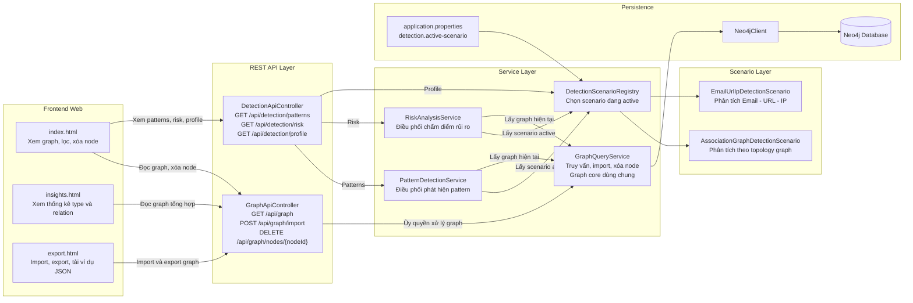
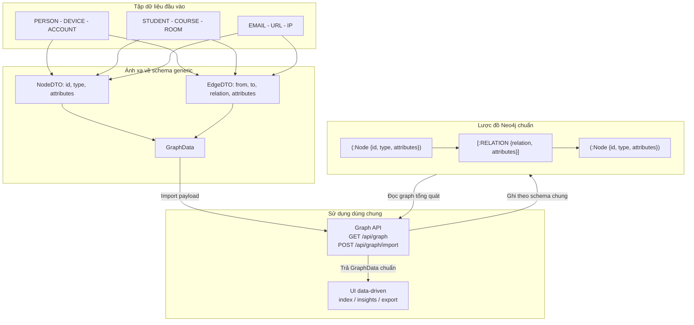
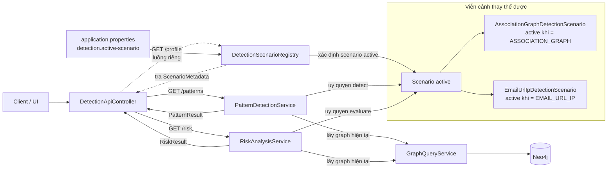
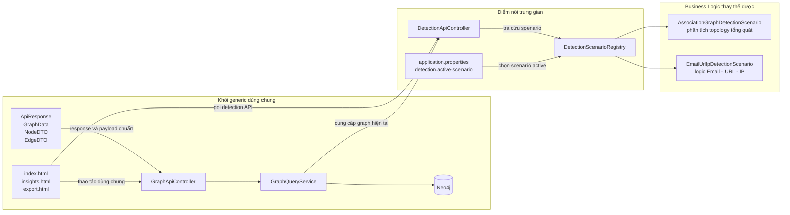
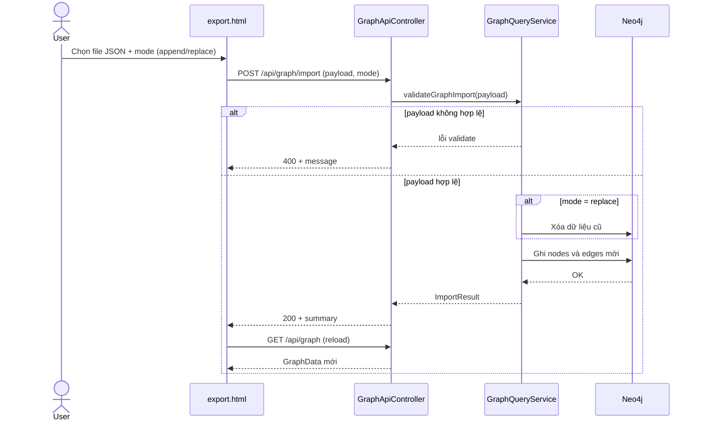
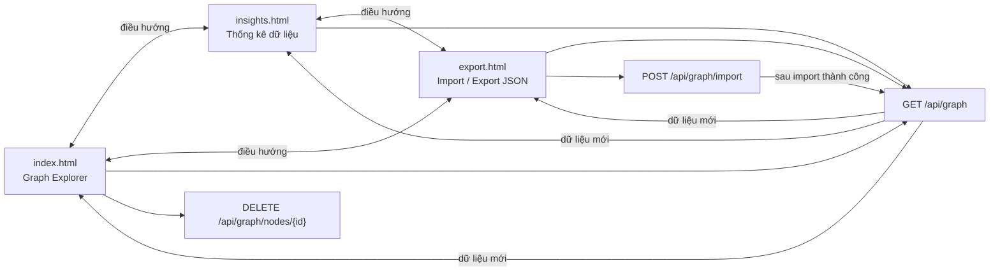

# DANH MỤC HÌNH VÀ BẢNG
Danh mục hình
- Hình 2.1. Kiến trúc tổng thể của hệ thống

- Hình 2.2. Tổng quát hóa lược đồ CSDL đồ thị ( Schema graph generic ) và ánh

xạ dữ liệu
- Hình 2.3. Luồng phân tích Mẫu ( patterns ) và kịch bản rủi ro theo viễn cảnh

( risk theo scenario )
- Hình 2.4. Phân tách giữa lõi tổng quát hóa (generic) và tầng kịch bản

(scenario)
- Hình 3.1. Trình tự import graph từ giao diện

- Hình 3.2. Quan hệ giữa các màn hình giao diện

Danh mục bảng
- Bảng 1. Các thành phần tổng quát hóa ( Generics ) và hướng đối tượng ( OOP )
chính trong hệ thống
- Bảng 2. Các điểm cuối API ( endpoint REST API ) hiện tại
- Bảng 3. So sánh phần tổng quát hóa (generic) và phần kịch bản (scenario)
trong hệ thống
- Bảng 4. Đánh giá mức độ đáp ứng mục tiêu đề tài theo mã nguồn hiện tại

# DANH MỤC NHỮNG TỪ VIẾT TẮT
API: Application Programming Interface (Giao diện chương trình ứng dụng)
DTO: Data Transfer Object (Đối tượng truyền dữ liệu)
HTML: HyperText Markup Language (Ngôn ngữ siêu văn bản)
JSON: JavaScript Object Notation (Miêu tả đối tượng JS)
NCKH: Nghiên cứu khoa học
OOP: Object-Oriented Programming (Lập trình hướng đối tượng)
REST: Representational State Transfer (Chuyển trạng thái trình diễn)
UI: User Interface (Giao diện người dùng)

# MỞ ĐẦU
Trong nhiều hệ thống phân tích dữ liệu đồ thị, mã nguồn ban đầu thường được viết
bám sát một bài toán cụ thể như gian lận giao dịch, mạng xã hội hoặc quản lý thực thể
liên kết. Khi đổi loại dữ liệu, nhà phát triển phải sửa lại nhiều lớp đầu cuối ( backend ) ,
nhiều cấu trúc DTO và cả giao diện hiển thị. Điều này làm giảm mạnh tính tái sử dụng
của hệ thống , tốn thời gian, nhân lực và khiến mã nguồn khó mở rộng.
Đề tài này tập trung giải quyết vấn đề đó bằng cách áp dụng kỹ thuật tổng quát hóa
( Generics ) trong phát triển ứng dụng Java để xây dựng một lõi xử lý đồ thị tổng quát.
Hệ thống được phát triển bằng Java Spring Boot, Neo4j và giao diện web trực quan
hóa đồ thị graph. Từ góc nhìn kiến trúc, thay vì định nghĩa mô hình (model)
riêng cho từng miền ( domain ) , dự án đưa mọi dữ liệu về một cấu trúc thống nhất gồm
nút ( node ) , cạnh ( edge ) và tập thuộc tính mở rộng. Trên nền chung đó, hệ thống có thể
hiển thị, lọc, nhập ( import ) và xuất ( export ) nhiều loại dữ liệu đồ thị khác nhau.
Phiên bản mã nguồn hiện tại còn tiến thêm một bước quan trọng: phần lõi đồ thị
( graph core ) và giao diện được giữ mức tổng quát hóa (generic) , trong khi phần phân
tích được tổ chức theo mô hình kịch bản hay viễn cảnh (scenario). Nghĩa là hệ thống
không cố ép toàn bộ nguyên tắc doanh nghiệp ( business logic ) thành tổng quát hóa
(Absolute generic) tuyệt đối, mà tách luật phân tích thành từng kịch bản có thể thay
thế. Cách tổ chức này phản ánh đúng trạng thái mã nguồn mở (open source code ) hiện
tại và cũng phù hợp với mục tiêu khoa học của đề tài: Tổng quát hóa (generic) hóa
phần kiến trúc dùng chung, đồng thời giữ khả năng triển khai các bài toán phân tích
chuyên biệt trên cùng một lõi đồ thị (Graph core ).

# TỔNG QUAN TÌNH HÌNH NGHIÊN CỨU THUỘC LĨNH VỰC ĐỀ TÀI
Trong lĩnh vực dữ liệu liên kết, cơ sở dữ liệu đồ thị (ví dụ như Neo4j ) được sử dụng
rộng rãi để biểu diễn quan hệ giữa các đối tượng [1]. Nhiều hệ thống hiện nay có thể trực
quan hóa đồ thị (Graph ) , tìm đường đi, phát hiện cụm liên kết và hỗ trợ ra quyết định
trên dữ liệu dạng mạng [4]. Tuy nhiên, trong các đồ án hoặc hệ thống minh họa, mã
nguồn thường bị gắn chặt với một miền (domain ) cụ thể. Khi đổi bài toán, hệ thống
phải chỉnh sửa từ lớp dữ liệu, dịch vụ ( service s) , điều khiển ( controller s) đến hiển thị
( frontend ).
Trong khi đó, Tổng quát hóa ( Generics ) trong kỹ thuật lập trình nói chung, và Java nói
riêng là công cụ mạnh để tổng quát hóa kiểu dữ liệu, tăng độ an toàn trong mã nguồn
( type safety ) và giảm lặp mã (code repetition) [2], [3]. Nếu được kết hợp đúng với kỹ thuật lập
trình hướng đối tượng ( OOP ) , tổng quát hóa ( Generics ) [2], [3] không chỉ giúp viết ít mã
nguồn (open source code ) hơn mà còn làm cho kiến trúc dễ tái sử dụng hơn. Với bài
toán đồ thị ( graph ) , việc áp dụng tổng quát hóa ( Generics ) vào DTO, đóng gói phản
hồi ( response wrapper s) và hợp đồng dịch vụ ( service contract s) [2], [3] tạo điều kiện để cùng
một lõi hệ thống duy nhất phục vụ nhiều tập dữ liệu khác nhau [6], [7].
Điểm đáng chú ý ở phiên bản hiện tại của dự án là sự tách biệt rõ giữa hai lớp trách
nhiệm:
- Phần tổng quát hóa (generic) : Mô hình dữ liệu đồ thị (Graph D d ata
model s) , DTO, API đồ thị ( API graph ) , khám khá giao diện người dùng ( UI
explorer ) , nhập và xuất ( import/export ).
- Phần chuyên biệt (Specialization) : Phát hiện ( detection ) và phân tích rủi ro ( risk
analysis ) theo từng kịch bản/viễn cảnh (scenario).
Đây là hướng tiếp cận thực tế hơn so với việc cố tổng quát tối đa hóa mọi quy tắc
nghiệp vụ. Nó cho phép giữ nguyên giao diện và lõi đồ thị ( graph core ) khi thay đổi
bài toán phân tích hay qui tắc doanh nghiệp [8], [9], [10], [17], [18].

# LÝ DO LỰA CHỌN ĐỀ TÀI
Đề tài được lựa chọn từ nhu cầu thực tế trong việc giảm phụ thuộc miền ( domain s) cho
các hệ thống phân tích đồ thị. Trong nhiều đồ án, kiến trúc ban đầu thường hoạt động
được với một bộ dữ liệu mẫu nhưng rất khó chuyển sang dữ liệu khác vì tên lớp, API
và giao diện đều viết cố định theo từng thực thể. Khi mở rộng sang bài toán khác, chi
phí chỉnh sửa trở nên lớn , nhiều bài toán thực hiện xây dựng lại từ đầu.
Việc xây dựng một hệ thống khám phá đồ thị (Graph explorer ) tổng quát giúp giải
quyết trực tiếp vấn đề trên đó. Thay vì chỉ làm một ứng dụng minh họa cho một tập nút
( node s) và các mối quan hệ ( relation s) cụ thể, đề tài hướng tới một nền tảng nhỏ có thể
dùng lại cho nhiều bài toán. Trạng thái mã nguồn hiện tại (open source code ) hiện tại
thể hiện rõ định hướng này: Lõi đồ thị ( graph core ) không phụ thuộc vào miền
( domain ) [1], [6], [7] , trong khi giao diện tự sinh từ dữ liệu, và còn phần phân tích được thay thế
bằng các viễn cảnh cụ thể ( scenario ) mà không cần viết lại phần hiển thị đầu cuối
(Frontend ).

# MỤC TIÊU, NỘI DUNG, PHƯƠNG PHÁP NGHIÊN CỨU CỦA ĐỀ TÀI
## 1. Mục tiêu nghiên cứu
- Xây dựng mô hình đồ thị ( graph ) tổng quát có thể tái sử dụng cho nhiều loại dữ
liệu.
- Áp dụng tổng quát hóa ( Generics ) vào DTO, API đáp từ ( response API ) và lớp
trừu tượng các dịch vụ ( service abstraction ) để giảm lặp mã.
- Xây dựng giao diện hướng dữ liệu ( data-driven -interface) có thể hiển thị dữ liệu
theo cấu trúc nút ( nodes ) và cạnh ( edges ) mà không mã cố định /miêu tả thực
thể ( hard-code entity ).
- Tổ chức phần phân tích theo viễn cảnh/kịch bản ( scenario ) để thay đổi bài toán
mà không phải thay đổi lõi đồ thị (graph core) và giao diện người
dùng (UI).
## 2. Nội dung nghiên cứu
- Nghiên cứu kỹ thuật tổng quát hóa ( Generics ) trong Java và cách kết hợp với
OOP.
- Thiết kế bộ DTO tổng quát gồm ApiResponse , GraphData , NodeDTO , và
EdgeDTO.
- Xây dựng GraphQueryService để truy vấn và nhập đồ thị ( import graph ) theo
lược đồ (schema) thống nhất trên Neo4j.
- Xây dựng GraphApiController và DetectionApiController theo phong cách đáp
từ ( response ) thống nhất.
- Xây dựng DetectionScenario , DetectionScenarioRegistry và các scenario cụ thể
để tách luật phân tích khỏi lõi đồ thị (graph core).
- Xây dựng giao diện khám phá đồ thị được tổng quát hóa ( Generic Graph
Explorer ) , trang thông tin ( Insights ) và trang nhập/xuất ( Import / Export ) theo
hướng tự thích nghi với tập dữ liệu ( dataset ) hiện tại.
## 3. Phương pháp nghiên cứu
- Phương pháp nghiên cứu tài liệu và tổng quan lý thuyết: hệ thống hóa tài liệu về
OOP, Generics, Java 17, Spring Boot, Neo4j, REST API và trực quan hóa đồ thị nhằm
hình thành cơ sở lý thuyết cho kiến trúc đề xuất [1], [2], [3], [4], [5], [6], [7], [23], [24], [25], [26].
- Phương pháp phân tích và tổng hợp hệ thống: phân rã hệ thống theo các thành phần
DTO, API, service, scenario và giao diện; sau đó tổng hợp lại thành mô hình lõi
generic và tầng nghiệp vụ theo viễn cảnh (scenario).
- Phương pháp mô hình hóa và thiết kế phần mềm: vận dụng nguyên tắc hướng đối
tượng kết hợp tổng quát hóa (Generics) để chuẩn hóa cấu trúc dữ liệu, thống nhất
lược đồ Neo4j dạng (:Node)-[:RELATION]->(:Node) và xây dựng giao diện
data-driven [1], [2], [3], [6], [7].
- Phương pháp thực nghiệm: triển khai prototype bằng Java 17, Spring Boot 3.3.0,
Spring Data Neo4j và vis-network; kiểm thử các luồng lấy graph, import graph, xóa
node, phát hiện pattern và đánh giá rủi ro theo scenario [1], [4], [6], [7].
- Phương pháp so sánh, đối chiếu và đánh giá: đối chiếu kết quả triển khai với mục
tiêu nghiên cứu về tối ưu mã nguồn, tăng tính tái sử dụng, tách biệt business logic và
khả năng mở rộng hệ thống [8], [9], [10], [17], [19].

Các phương pháp trên bám theo phân loại phổ biến trong nghiên cứu khoa học gồm:
nghiên cứu tài liệu, phân tích - tổng hợp, mô hình hóa, thực nghiệm và đánh giá; đồng
thời được hiệu chỉnh cho bối cảnh kỹ thuật phần mềm và đối tượng nghiên cứu là hệ
thống phân tích đồ thị có khả năng tái sử dụng [5].

# ĐỐI TƯỢNG VÀ PHẠM VI NGHIÊN CỨU
## 1. Đối tượng nghiên cứu
Đối tượng nghiên cứu là kiến trúc phần mềm của hệ thống phân tích đồ thị có khả
năng tái sử dụng, trong đó trọng tâm là cách dùng tổng quát hóa (Generics) để
chuẩn hóa cấu trúc dữ liệu và API, đồng thời tách qui tắc doanh nghiệp ( business
logic ) phân tích thành các viễn cảnh (scenario) độc lập.
## 2. Phạm vi nghiên cứu
- Backend được xây dựng bằng Spring Boot.
- Cơ sở dữ liệu sử dụng Neo4j.
- Lược đồ (schema) dữ liệu chung của hệ thống là
(:Node)-[:RELATION]->(:Node).
- Frontend web hiển thị đồ thị ( graph ) , bộ lọc, thông tin chi tiết và nhập/xuất
(import/export) import/export dữ liệu.
- Detection và risk analysis được triển khai theo viễn cảnh (scenario) ,
trong đó viễn cảnh (scenario) mặc định hiện tại là
ASSOCIATION_GRAPH.
- Hệ thống chưa đi vào học máy hay dự đoán nâng cao trong kịch bản/viễn cảnh ,
mà tập trung vào kiến trúc tái sử dụng và khả năng mở rộng mã nguồn cho
nhiều ứng dụng khác nhau, với tiêu chí “one-for-all”, để tăng tối đa tái sử
dụng framework và mã nguồn mở trong các ứng dụng truyền thống
(traditional applications) hay các ứng dụng định hướng AI
(AI-driven-applications). Nghiên cứu, được dựa trên từ bài toán thực tế của
doanh nghiệp phát triển phần mềm của New Zealand (ECON NZ) đã thất bại
trong triển khai ý tưởng này.

# KẾT QUẢ NGHIÊN CỨU VÀ THẢO LUẬN
## CHƯƠNG 1. CƠ SỞ LÝ THUYẾT VÀ NỀN TẢNG THIẾT KẾ
### 1.1. Vai trò của OOP và tổng quát hóa (Generics) trong đề tài
Trong Java, OOP giúp xây dựng hành vi chung qua Giao diện (interface ) , Lớp trừu
tượng (abstract class ) và nguyên tắc phân lớp trách nhiệm. Tổng quát hóa
(Generics) bổ sung khả năng tham số hóa kiểu dữ liệu để cùng một cấu trúc
có thể sử dụng lại cho nhiều dạng dữ liệu khác nhau mà vẫn đảm bảo an toàn kiểu tại
thời điểm biên dịch [2], [3].
Trong hệ thống hiện tại, OOP và tổng quát hóa (Generics) không tách rời
nhau mà kết hợp theo đúng tinh thần thiết kế phần mềm:
- OOP tạo bộ khung tổ chức cho bộ điều khiển (controller ) , dịch vụ (service ) ,
viễn cảnh (Scenario) và các chiến lược cụ thể (Strategy).
- Tổng quát hóa (Generics) giúp bộ khung đó làm việc với nhiều kiểu dữ
liệu đồ thị ( graph ) mà không phải viết lại lớp mới cho từng miền
(domain) [2], [3].
Trong thực hành triển khai, các chủ điểm như type erasure, generic method và wildcard
cũng là các điểm cần lưu ý để tối ưu khả năng tái sử dụng và tránh lỗi kiểu dữ liệu [16].
### 1.2. Các thành phần generic chính trong mã nguồn
Bảng 1. Các thành phần tổng quát hóa (Generics) và OOP chính trong hệ
thống
Thành phần Vai trò trong hệ thống
ApiResponse Chuẩn hóa dữ liệu trả về từ API
GraphData<N, E> Mô tả đồ thị ( graph ) tổng quát gồm nút ( nodes ) và
cạnh ( edges )
NodeDTO Mô tả nút ( node ) với id , type và attributes tổng quát
EdgeDTO Mô tả cạnh ( edge ) với từ ( from ) , tới ( to ) , mối liên hệ
( relation ) và thuộc tính ( attributes ) tổng quát
BaseService<T, ID> Dịch vụ giao diện ( Interface service ) tổng quát cho
thao tác dùng chung
BaseServiceImpl<T,
ID>
Lớp trừu tượng ( Abstract class ) gồm gom qui tắc
( logic ) mặc định cho dịch vụ (service )
PatternRule Hợp đồng/nguyên tắc ( Contract ) tổng quát cho một

luật phát hiện mẫu (patterns)
RiskScoreStrategy<C,
R>
Hợp đồng/nguyên tắc ( Contract ) tổng quát cho chiến
lược chấm điểm (Scenario)
DetectionScenario Hợp đồng/nguyên tắc ( Contract ) cho một kịch bản
phân tích độc lập (Scenario)
Hệ thống hiện dùng :
GraphData<NodeDTO<Map<String, Object>>, EdgeDTO<Map<String,
Object>>>
làm cấu trúc đồ thị graph chuẩn cho cả phần cuối ( backend ) và phần hiển thị
( frontend ). Đây là điểm then chốt tạo nên tính tái sử dụng của mã nguồn.
### 1.3. Tư tưởng kiến trúc hiện tại
Phiên bản code hiện tại được xây dựng theo nguyên tắc sau:
- Tổng quát hóa (Generics) hóa phần lõi lưu trữ, truy vấn và hiển thị đồ thị (graph) [2], [3].
- Không tối ưu hóa tuyệt đối (No Absolute generic) hóa cưỡng ép toàn bộ
business logic phân tích.
- Tách phần nghiệp vụ phát hiện Mẫu (patterns) và chấm điểm thành viễn cảnh
(scenario) có thể thay đổi.
Điều này có nghĩa là khi đổi bài toán phân tích, nhà phát triển không cần viết lại
GraphQueryService, GraphApiController, nhập/xuất (import/export) hay
giao diện explorer [6], [7]. Chỉ cần thay đổi viễn cảnh (scenario) đang sử dụng active
hoặc bổ sung viễn cảnh (scenario) mới [17], [18], [20].
## CHƯƠNG 2. THIẾT KẾ VÀ TRIỂN KHAI HỆ THỐNG
### 2.1. Kiến trúc tổng thể
Hệ thống được triển khai theo chuỗi xử lý sau:
- Frontend Web
- REST API
- GraphApiController / DetectionApiController
- GraphQueryService / PatternDetectionService / RiskAnalysisService
- DetectionScenarioRegistry
- Neo4jClient
- Neo4j Database
Trong kiến trúc này, GraphQueryService đóng vai trò lõi đồ thị (graph core). Mọi luồng hiển thị và phân tích đều lấy dữ liệu từ lõi đồ thị (graph core) chung thay vì tự truy vấn riêng theo từng miền (domain) [1], [6], [7].
Hình 2.1. Kiến trúc tổng thể của hệ thống



Diễn giải Hình 2.1:
- Trong Frontend Web,ba màn hình frontend cùng dùng chung một lõi đồ thị (graph core) ở backend (GraphApiController), nên khi thay tập dữ liệu (dataset) hoặc thay viễn cảnh (scenario) thì không phải viết lại từng trang riêng rẽ.
- Luồng đồ thị (Graph) và luồng khai phá (Detection) được tách rõ: GraphApiController xử lý dữ liệu đồ thị, còn DetectionApiController chỉ điều phối sang viễn cảnh (scenario) đang sử dụng (active).
- DetectionScenarioRegistry là điểm nối giữa phần tổng quát hóa (generic) và phần nghiệp vụ, giúp đổi bài toán phân tích mà không làm thay đổi giao diện người dùng (UI).
### 2.2. Lõi tổng quát hóa đồ thị (Graph generic)
GraphQueryService truy vấn dữ liệu từ Neo4j theo lược đồ (schema) thống
nhất (:Node)-[:RELATION]->(:Node) [1], [6], [7].
Dữ liệu nút (node) được đọc từ các trường id, type và properties(n). Dữ liệu cạnh
( edge ) được đọc từ ( from ) , tới ( to ) , mối quan hệ ( relation ) và các thuộc tính
( properties(r) ).
Các thuộc tính động được gom vào thuộc tính (generic attributes) attributes để không
khóa cứng cấu trúc của nút và cạnh ( node và edge ).
Khi nhập ( import ) dữ liệu, hệ thống nhận tải dữ liệu ( payload GraphData ) với hai
mảng các nút và cạnh ( nodes và edges ). Người dùng có thể chọn thêm (append ) hoặc
thay thế (replace ). Cách triển khai này cho phép cùng một đầu cuối ( backend ) nhận
các tập dữ liệu (dataset) hoàn toàn khác nhau về mặt nội dung và ngữ cảnh, ví
dụ như PERSON-DEVICE-ACCOUNT , STUDENT-COURSE-ROOM hoặc
EMAIL-URL-IP miễn là dữ liệu được mã hóa đưa về đúng lược đồ (schema)
chung.
Trong đó, payload trao đổi giữa frontend và backend được biểu diễn theo định dạng
JSON chuẩn RFC 8259 để đảm bảo tính tương thích liên nền tảng [24].
Hình 2.2. Lược đồ (schema) tổng quát hóa đồ thị (graph generic) và ánh xạ dữ liệu



Diễn giải hình 2.2:
- Mọi tập dữ liệu (dataset) đều được đưa về cùng một lược đồ
(schema) chuẩn gồm các nút và cạnh ( nodes và edges ) , nên phần đầu
cuối ( backend ) không cần sinh mô hình ( model ) riêng cho từng miền
(domain).
- Trường thuộc tính (attributes ) giữ vai trò mở rộng linh hoạt, cho phép thêm dữ
liệu mới mà không phải thay đổi cấu trúc DTO gốc.
- Đây là cơ sở để giao diện người dùng (UI) tự sinh kiểu ( type ) , mối quan hệ
( relation ) và nhãn hiển thị (label) từ dữ liệu thực tế trong CSDL ( database ).
### 2.3. Tầng API hiện tại
Bảng 2. Các endpoint REST API hiện tại

Endpoint Chức năng
GET /api/graph Trả về toàn bộ đồ thị (Graph ) tổng quát
POST /api/graph/import Nhập đồ thị ( Import graph ) mới vào Neo4j
DELETE
/api/graph/nodes/{nodeId}
Xóa một nút ( node ) và các cạnh liên quan
theo id

GET /api/detection/patterns Trả về các mẫu (patterns) phát hiện theo
viễn cảnh (scenario) đang hoạt động
(active )
GET /api/detection/risk Trả về danh sách chấm điểm rủi ro theo viễn
cảnh (scenario) đang hoạt động
(active )
GET /api/detection/profile Trả về viễn cảnh (scenario) hiện
hành và danh sách viễn cảnh
(scenario) khả dụng
Điểm cần nhấn mạnh là khai phá đầu cuối ( endpoint detection ) không còn trả về hồ sơ
( profile ) tĩnh như trước. Thay vào đó, bộ điều khiển ( controller ) lấy thông tin từ
DetectionScenarioRegistry để phản ánh viễn cảnh (scenario) đang hoạt động
thực sự trong mã nguồn [6], [7].
Các endpoint cũng tuân theo ngữ nghĩa HTTP chuẩn cho thao tác đọc, ghi, xóa và có
thể được mô tả bằng đặc tả OpenAPI để chuẩn hóa tài liệu kỹ thuật, hỗ trợ kiểm thử
và tích hợp hệ thống [25], [26].
### 2.4. Tầng phân tích theo viễn cảnh (scenario)
Đây là thay đổi quan trọng nhất của phiên bản hiện tại.
DetectionScenario là giao diện ( interface ) mô tả một kịch bản phân tích, gồm các
thành phần:
- key: mã định danh của viễn cảnh (scenario)
- displayName: tên hiển thị
- detect: trả về DetectionResult chứa các mẫu ( pattern ) phát hiện
- evaluate: trả về RiskResult chứa các mục chấm điểm
- describe: trả về metadata mô tả viễn cảnh (scenario)
DetectionScenarioRegistry quản lý toàn bộ viễn cảnh (scenario) có trong hệ
thống và chọn viễn cảnh (scenario) đang hoạt động ( active ) thông qua cấu
hình detection.active-scenario trong application.properties.
Hai viễn cảnh (scenario) hiện đang có trong mã nguồn là:
- ASSOCIATION_GRAPH: viễn cảnh (scenario) mặc định, phù hợp với
dữ liệu dạng ACCOUNT, PERSON, DEVICE, TRANSACTION hoặc các đồ
thị graph liên kết tổng quát.
- EMAIL_URL_IP: viễn cảnh (scenario) minh họa cho bài toán Email -
URL - IP từ giai đoạn trước.
PatternDetectionService và RiskAnalysisService hiện không còn nắm giữ nguyên tắc
( logic ) phân tích cụ thể. Hai service này chỉ làm hai việc:
- gọi GraphQueryService để lấy graph hiện tại
- ủy quyền cho viễn cảnh (scenario) hiện tại ( active ) để xử lý

Nhờ vậy, lõi đồ thị (graph core) và bộ điều khiển ( controller ) không phụ
thuộc trực tiếp vào bài toán phân tích cụ thể.
Hình 2.3. Luồng phân tích (pattern) và rủi ro (risk) theo viễn cảnh (scenario)



(scenario)
Luồng phân tích Mẫu (patterns) và rủi ro (risk) theo viễn cảnh (scenario) được diễn giải Hình 2.3 như sau:
-Service detection (Pattern Detection Service) không tự chứa luật phân tích cố định mà luôn lấy đồ thị hiện tại rồi ủy quyền cho viễn cảnh (scenario) đang hoạt động (Active Detection Scenario).
-Hồ sơ đầu cuối (Endpoint profile) đi trực tiếp tới registry (Detection Scenario Registry) theo một luồng riêng, vì mục tiêu của nó là mô tả trạng thái cấu hình hiện hành thay vì chạy phân tích trên dữ liệu.
-Cách tách này giúp phần phát hiện (detection) thay được theo bài toán, nhưng (contract) API gửi ra ngoài vẫn ổn định.

### 2.5. Viễn cảnh (Scenario) mặc định ASSOCIATION_GRAPH
Viễn cảnh (Scenario) ASSOCIATION_GRAPH được thiết kế để phù hợp với
định hướng generic hơn của hệ thống hiện tại. Viễn cảnh (Scenario) này không
giả định node phải là Email, URL hay IP. Thay vào đó, nó dựa trên cấu trúc liên kết
của graph để phát hiện một số mẫu đáng chú ý như:
- HIGH_DEGREE_NODE: node có số liên kết cao
- SHARED_RELATION_TARGET: nhiều node cùng trỏ đến một node qua cùng
relation
- MULTI_TYPE_BRIDGE: node kết nối tới nhiều nhóm đối tượng khác nhau
Việc chấm điểm rủi ro cũng dựa trên topology của graph, ví dụ số bậc của node, số
loại relation, số loại neighbor và việc node có là shared target hay không. Kết quả
được phân thành SAFE, SUSPICIOUS hoặc HIGH_INTEREST.
### 2.6. Mối quan hệ giữa phần generic và phần viễn cảnh (scenario)
Bảng 3. So sánh phần generic và phần viễn cảnh (scenario) trong hệ thống
Thành phần Tính chất
GraphData, NodeDTO, EdgeDTO,
ApiResponse
Generic và dùng chung
GraphQueryService Generic và dùng chung
GraphApiController Generic và dùng chung
index.html, insights.html, export.html Generic và data-driven
DetectionApiController Dùng chung, nhưng ủy quyền cho
viễn cảnh (scenario)
DetectionScenarioRegistry Bộ chọn viễn cảnh
(scenario)
AssociationGraphDetectionScenario Business logic chuyên biệt theo
topology
EmailUrlIpDetectionScenario Business logic chuyên biệt theo bài
toán Email - URL - IP
Như vậy, mã nguồn hiện tại phản ánh đúng quan điểm: phần generic nằm ở cấu trúc hệ
thống và giao diện, còn phần luật phân tích là mô-đun thay thế được.
Hình 2.4. Phân tách giữa lõi generic và tầng viễn cảnh (scenario)



Phân tách giữa lõi tổng quan hóa (Generics) và tầng viễn cảnh (scenario) được miêu tả như  Hình 2.4, diễn giải như sau :
- Khối bên trái (Phần Generic dùng chung) là phần phải ổn định và tái sử dụng được cho nhiều bài toán khác nhau.
- Khối bên phải (Business Logic thay thế được) là phần được phép thay đổi theo nghiệp vụ, ví dụ đổi từ phân tích cấu hình mạng các quan hệ (topology) sang phân tích logic cụ thể, ví dụ: Email - URL - IP.
- Điểm nối (DetectionApiController và DetectionScenarioRegistry) là hai điểm trung gian giúp kết nối hai khối mà không làm giao diện người dùng (UI) bị phụ thuộc hay biến đổi thủ công vào một viễn cảnh (scenario) cụ thể.

## CHƯƠNG 3. GIAO DIỆN TRỰC QUAN HÓA VÀ THỰC NGHIỆM

### 3.1. Generic Graph Explorer
Trang index.html là giao diện chính của hệ thống, có tên Generic Graph Explorer. Giao
diện này lấy dữ liệu từ endpoint GET /api/graph và xây dựng toàn bộ phần hiển thị dựa
trên dữ liệu nhận được.
Các đặc điểm quan trọng của giao diện gồm:
- Node label được lấy ưu tiên từ các thuộc tính như label, name, title rồi mới
fallback về id.
- Màu node được gán theo type.
- Edge label được lấy từ relation.
- Panel chi tiết hiển thị toàn bộ attributes ở dạng JSON.
- Người dùng có thể xóa node đang chọn ngay trên panel chi tiết qua API
DELETE /api/graph/nodes/{nodeId}.
- Bộ lọc node type và relation được sinh tự động từ tập dữ liệu (dataset)
hiện tại.
- Khi dữ liệu thay đổi, giao diện không cần sửa mã để nhận loại node hoặc
relation mới.
Điểm này chứng minh rõ rằng giao diện người dùng (UI) của hệ thống hiện đã
generic hóa thành công [4], [6], [7].
Nói cách khác, phần giao diện đóng vai trò một lớp hiển thị trung lập theo dữ liệu:
khi thêm node type, relation hoặc thuộc tính mới từ backend, frontend vẫn tái sử dụng
cùng cơ chế render và lọc mà không cần chỉnh sửa theo từng miền bài toán [4], [6], [7].
Điều này cũng nhất quán với định hướng kiến trúc toàn hệ thống, trong đó UI và graph
core giữ ổn định, còn luật phân tích được thay thế theo viễn cảnh (scenario).
### 3.2. Trang Import / Export
Trang export.html cho phép xem payload graph hiện tại, tải xuống dữ liệu dạng JSON
và nhập một payload mới thông qua POST /api/graph/import. Người dùng có thể chọn
replace mode để ghi đè dữ liệu hoặc append mode để nối dữ liệu mới vào graph hiện
tại. Giao diện cũng phản hồi rõ lỗi import khi payload sai định dạng hoặc vi phạm ràng
buộc cơ bản.
Ví dụ payload mẫu trong giao diện sử dụng các loại node STUDENT, COURSE,
ROOM và relation ENROLLED_IN, TAUGHT_IN. Chi tiết này cho thấy hệ thống
không bị khóa vào một miền (domain) duy nhất mà có thể tiếp nhận dữ liệu
mới miễn là đúng cấu trúc chung [1], [6], [7].
Hình 3.1. Trình tự import graph từ giao diện



Trình tự nhập đồ thị từ giao diện được miêu tả trên Hình 3.1, trong đó: 
- Bước validateGraphImport diễn ra trước khi ghi xuống Neo4j để chặn sớm tải dữ liệu (payload) sai cấu trúc hoặc sai liên kết tham chiếu.
- Chế độ thay thế và chèn (Replace và append mode) (api/graph/import?replace) dùng chung một luồng import, chỉ khác ở bước xóa dữ liệu cũ trước khi ghi mới.
- Sau khi nhập (import) thành công, giao diện tải lại đồ thị (graph) để người dùng nhìn thấy ngay kết quả mà không cần mở trang khác.

### 3.3. Trang Insights
Trang insights.html tách riêng phần thống kê và danh sách dữ liệu khỏi màn hình
graph chính. Trang này đọc trực tiếp từ GET /api/graph để hiển thị số lượng node,
edge, node type và relation, đồng thời sinh danh sách type/relation hoàn toàn theo dữ
liệu hiện có trong database.
Việc tách trang này giúp giao diện chính tập trung vào trực quan hóa và thao tác trên
graph, còn phần thông tin tổng hợp được gom về một màn hình riêng. Đây cũng là
điểm phù hợp với góp ý của giảng viên: giao diện người dùng (UI) vẫn generic,
nhưng các nhóm thao tác được tổ chức lại rõ ràng hơn theo mục đích sử dụng [4], [6], [7].
Hình 3.2. Quan hệ giữa các màn hình giao diện



Quan hệ giữa các màn hình giao diện được diễn giải Hình 3.2, trong đó:
- Ba trang giao diện không tách rời nhau về dữ liệu mà cùng dùng chung các đồ thị đầu cuối (endpoint graph), nên trạng thái luôn nhất quán sau nhập (import) hoặc xóa nút.
- Trang khai phá (explorer) tập trung vào thao tác trực quan; trang insights tập trung vào thống kê; trang export tập trung vào luồng dữ liệu vào ra.
- Cách tách vai trò màn hình như vậy giúp giao diện người dùng (UI) mạch lạc hơn nhưng vẫn giữ nguyên bản chất tổng quát hóa của hệ thống.

### 3.4. Thử nghiệm theo mã nguồn hiện tại
Theo code hiện tại, hệ thống có hai bài thử nghiệm quan trọng về mặt kiến trúc [6], [7]:
- Thử nghiệm graph generic: lấy graph, import graph và xóa node qua
GraphApiControllerTest.
- Thử nghiệm detection API theo viễn cảnh (scenario) : truy xuất pattern,
risk và profile qua DetectionApiControllerTest.
Ngoài ra, cấu trúc mã nguồn cho thấy có thể thực nghiệm nhanh bằng cách thay
detection.active-scenario trong application.properties để dùng viễn cảnh
(scenario) khác mà không phải thay đổi giao diện hoặc graph API.
### Đánh giá kết quả nghiên cứu
Bảng 4. Đánh giá mức độ đáp ứng mục tiêu đề tài theo mã nguồn hiện tại

| Tiêu chí | Đánh giá |
|---|---|
| Generic Data Model | Đạt |
| Generic DTO | Đạt |
| Generic Response API | Đạt |
| Generic Graph Query Service | Đạt |
| Generic UI | Đạt |
| Generic Import / Export | Đạt |
| Thay đổi luật phân tích mà không đổi giao diện người dùng (UI) | Đạt |
| Business logic phân tích hoàn toàn generic | Không đặt mục tiêu ở phiên bản hiện tại |
Kết quả nghiên cứu cho thấy hệ thống hiện tại đã đạt được phần cốt lõi của đề tài: tối
ưu hóa mã nguồn và tăng tính tái sử dụng ở phần lõi đồ thị (graph core) ,
API, DTO và giao diện. So với trạng thái ban đầu bám nhiều vào một bài toán minh
họa, mã nguồn hiện đã tiến đến cấu trúc hợp lý hơn: một lõi generic dùng chung và
một tầng viễn cảnh (scenario) để thay business logic theo nhu cầu [6], [7].
Điểm quan trọng cần trình bày trung thực trong báo cáo là phần detection của hệ thống
hiện không phải generic theo nghĩa một thuật toán duy nhất xử lý mọi bài toán. Thay
vào đó, detection được thiết kế dưới dạng viễn cảnh (scenario) có thể thay thế [6], [7].
Đây không phải hạn chế của hệ thống mà là quyết định kiến trúc phù hợp với thực tế
triển khai và phù hợp với mục tiêu giữ lõi đồ thị (graph core) ở mức tái sử dụng cao.

# KẾT LUẬN VÀ KIẾN NGHỊ
a) Kết luận
Đề tài đã xây dựng được một hệ thống phân tích và trực quan hóa đồ thị theo hướng tái
sử dụng, trong đó phần generic được áp dụng rõ ràng vào mô hình dữ liệu, DTO, API,
service graph và giao diện hiển thị. Hệ thống sử dụng chung một cấu trúc graph gồm
nodes, edges và attributes, cho phép tiếp nhận nhiều loại tập dữ liệu (dataset)
khác nhau mà không phải thay đổi kiến trúc lõi [1], [6], [7].
Đóng góp nổi bật của phiên bản mã nguồn hiện tại là việc tổ chức tầng phân tích theo
viễn cảnh (scenario). Cách làm này giúp hệ thống đạt được hai mục tiêu đồng
thời:
- giữ lõi đồ thị (graph core) và giao diện người dùng (UI) ổn định,
có thể tái sử dụng
- vẫn triển khai được các luật phân tích chuyên biệt theo từng bài toán
Những đóng góp chính của đề tài gồm:
- Xây dựng bộ DTO tổng quát cho dữ liệu graph.
- Chuẩn hóa phản hồi REST bằng ApiResponse.
- Xây dựng GraphQueryService cho truy vấn, import và xóa node theo lược đồ
(schema) chung.
- Xây dựng giao diện Generic Graph Explorer, Insights và Import / Export theo
hướng data-driven.
- Tách luật phân tích thành DetectionScenario và quản lý bằng
DetectionScenarioRegistry.
- Cài đặt viễn cảnh (scenario) mặc định ASSOCIATION_GRAPH và
duy trì thêm viễn cảnh (scenario) EMAIL_URL_IP để minh họa khả
năng thay thế business logic.
Nhìn từ góc độ học thuật, đóng góp mới của đề tài không nằm ở việc tạo ra một thuật
toán phát hiện duy nhất cho mọi bài toán, mà nằm ở việc đề xuất một kiến trúc graph
có tính tái sử dụng cao: dữ liệu, API và giao diện được generic hóa; còn phần phân
tích được mô-đun hóa thành các viễn cảnh (scenario) độc lập. Cách tiếp cận
này phù hợp với thực tế phát triển phần mềm, giảm chi phí sửa đổi khi thay đổi miền
(domain) và tạo nền tảng để mở rộng các bài toán phân tích đồ thị khác trong
tương lai.
b) Kiến nghị
- Bổ sung validate sâu hơn cho payload import để kiểm tra thêm quy tắc dữ liệu
nghiệp vụ ngoài các kiểm tra cơ bản hiện đã có cho id, type, relation và liên kết
tham chiếu.

- Bổ sung endpoint hoặc giao diện cho phép đổi viễn cảnh (scenario) trực
tiếp thay vì chỉ cấu hình trong application.properties.
- Viết thêm viễn cảnh (scenario) cho các miền dữ liệu khác như giáo dục,
logistics hoặc knowledge graph để chứng minh mạnh hơn tính tái sử dụng của
lõi đồ thị (graph core).
- Tiếp tục hoàn thiện test tích hợp trên môi trường Java 17 để xác nhận đầy đủ
hành vi runtime của toàn bộ hệ thống, đồng thời đánh giá khả năng tương thích khi
nâng cấp theo các bản LTS và framework mới hơn [12], [13].
- Khi triển khai thực tiễn, cần bổ sung cơ chế quản lý cấu hình và bảo mật tốt
hơn, đặc biệt là đưa thông tin kết nối cơ sở dữ liệu ra khỏi mã nguồn và tổ chức
quy trình cấu hình theo môi trường.
- Có thể mở rộng hệ thống thành nền tảng hỗ trợ phân tích dữ liệu liên kết cho
các đơn vị đào tạo, doanh nghiệp hoặc tổ chức nghiên cứu, trong đó cùng một
lõi đồ thị (graph core) phục vụ nhiều bộ dữ liệu khác nhau.
- Về định hướng nghiên cứu tiếp theo, có thể kết hợp thêm các chỉ số graph
analytics hoặc kỹ thuật học máy trên graph để nâng cao chất lượng phân tích
mà vẫn giữ nguyên lõi generic hiện có [11].

# TÀI LIỆU THAM KHẢO
Văn bản pháp qui:
Hiện không sử dụng văn bản pháp qui chuyên ngành làm nguồn trích dẫn trực tiếp.

Sách, báo, tạp chí và tài liệu kỹ thuật:
[1] Neo4j, Cypher Manual, 2024. Truy cập ngày 17/03/2026. Địa chỉ:
https://neo4j.com/docs/cypher-manual/current/

[2] Oracle, The Java Language Specification, Java SE 17 Edition, 2021. Truy cập
ngày 17/03/2026. Địa chỉ:
https://docs.oracle.com/javase/specs/jls/se17/html/index.html

[3] Oracle, The Java Tutorials: Generics, Oracle Documentation. Truy cập ngày
17/03/2026. Địa chỉ: https://docs.oracle.com/javase/tutorial/java/generics/

[4] vis-network, vis-network Documentation, 2024. Truy cập ngày 17/03/2026.
Địa chỉ: https://visjs.github.io/vis-network/docs/network/

[5] Viện Nghiên cứu Tâm Anh (TAMRI), Các phương pháp nghiên cứu khoa học
thường dùng trong nghiên cứu, 2025. Truy cập ngày 17/03/2026. Địa chỉ:
https://tamri.vn/bai-viet/phuong-phap-nghien-cuu-khoa-hoc/

[6] VMware, Spring Boot Reference Documentation, version 3.3.0, 2024. Truy cập
ngày 17/03/2026. Địa chỉ:
https://docs.spring.io/spring-boot/docs/3.3.0/reference/html/

[7] VMware, Spring Data Neo4j Reference Documentation, 2024. Truy cập ngày
17/03/2026. Địa chỉ: https://docs.spring.io/spring-data/neo4j/reference/

Bài báo khoa học và kỷ yếu hội thảo:
[8] Vittorio Cortellessa, J. Andres Diaz-Pace, Daniele Di Pompeo and Michele
Tucci, Towards Assessing Spread in Sets of Software Architecture Designs,
European Conference on Software Architecture 2023, 2024. DOI:
10.1007/978-3-031-42592-9_9. Truy cập ngày 17/03/2026. Địa chỉ:
https://arxiv.org/abs/2402.19171

[9] Daniele Di Pompeo and Michele Tucci, Quality Attributes Optimization of
Software Architecture: Research Challenges and Directions, 20th International
Conference on Software Architecture, ICSA 2023 Companion, 2023. DOI:
10.1109/ICSA-C57050.2023.00061. Truy cập ngày 17/03/2026. Địa chỉ:
https://arxiv.org/abs/2301.07516

[10] Timo Greifenberg, Klaus Müller and Bernhard Rumpe, Architectural
Consistency Checking in Plugin-Based Software Systems, European Conference on
Software Architecture Workshops, pp. 58:1-58:7, 2015. DOI:
10.1145/2797433.2797493. Truy cập ngày 17/03/2026. Địa chỉ:
https://arxiv.org/abs/1510.08510

[11] Neo4j, Graph Data Science Library Manual, 2025. Truy cập ngày 18/03/2026.
Địa chỉ: https://neo4j.com/docs/graph-data-science/current/

[12] Oracle, Java SE 21 Documentation, 2023. Truy cập ngày 18/03/2026.
Địa chỉ: https://docs.oracle.com/en/java/javase/21/

[13] VMware, Spring Boot 3.4 Release Notes, 2024. Truy cập ngày 18/03/2026.
Địa chỉ:
https://github.com/spring-projects/spring-boot/wiki/Spring-Boot-3.4-Release-Notes

[14] Microsoft, C# Programming Guide - Generics, 2025. Truy cập ngày 18/03/2026.
Địa chỉ:
https://learn.microsoft.com/en-us/dotnet/csharp/programming-guide/generics/

[15] TypeScript Documentation, Generics (Handbook 2), 2025. Truy cập ngày
18/03/2026. Địa chỉ:
https://www.typescriptlang.org/docs/handbook/2/generics.html

[16] Baeldung, Java Generics, 2025. Truy cập ngày 18/03/2026. Địa chỉ:
https://www.baeldung.com/java-generics

[17] Len Bass, Paul Clements and Rick Kazman, Software Architecture in Practice,
4th Edition, Addison-Wesley Professional, 2021. Truy cập ngày 19/03/2026. Địa chỉ:
https://www.informit.com/store/software-architecture-in-practice-9780136886098

[18] Martin Fowler, Patterns of Enterprise Application Architecture,
Addison-Wesley Professional, 2002. Truy cập ngày 19/03/2026. Địa chỉ:
https://martinfowler.com/books/eaa.html

[19] Erich Gamma, Richard Helm, Ralph Johnson and John Vlissides,
Design Patterns: Elements of Reusable Object-Oriented Software,
Addison-Wesley Professional, 1994. Truy cập ngày 19/03/2026. Địa chỉ:
https://www.informit.com/store/design-patterns-elements-of-reusable-object-oriented-9780201633610

[20] Ian Robinson, Jim Webber and Emil Eifrem,
Graph Databases: New Opportunities for Connected Data, 2nd Edition,
O'Reilly Media, 2015. Truy cập ngày 19/03/2026. Địa chỉ:
https://www.oreilly.com/library/view/graph-databases-2nd/9781491930884/

[21] William L. Hamilton, Graph Representation Learning,
Morgan & Claypool Publishers, 2020. Truy cập ngày 19/03/2026. Địa chỉ:
https://www.morganclaypool.com/doi/10.2200/S01054ED1V01Y202003AIM046

[22] Mark Newman, Networks: An Introduction,
Oxford University Press, 2010. Truy cập ngày 19/03/2026. Địa chỉ:
https://global.oup.com/academic/product/networks-9780199206659

[23] ISO/IEC, ISO/IEC 25010:2011 Systems and software engineering -
Systems and software Quality Requirements and Evaluation (SQuaRE) -
System and software quality models, 2011. Truy cập ngày 19/03/2026. Địa chỉ:
https://iso25000.com/index.php/en/iso-25000-standards/iso-25010

[24] T. Bray, The JavaScript Object Notation (JSON) Data Interchange Format,
RFC 8259, IETF, 2017. Truy cập ngày 19/03/2026. Địa chỉ:
https://www.rfc-editor.org/rfc/rfc8259

[25] R. Fielding, M. Nottingham and J. Reschke, HTTP Semantics,
RFC 9110, IETF, 2022. Truy cập ngày 19/03/2026. Địa chỉ:
https://www.rfc-editor.org/rfc/rfc9110

[26] OpenAPI Initiative, OpenAPI Specification 3.1.0,
2021. Truy cập ngày 19/03/2026. Địa chỉ:
https://spec.openapis.org/oas/v3.1.0

# PHỤ LỤC
Phụ lục A. Ví dụ cấu trúc JSON graph tổng quát
{
"nodes": [
{
"id": "P1",
"type": "PERSON",
"attributes": {
"name": "Alice"
}
},
{
"id": "D1",
"type": "DEVICE",
"attributes": {
"os": "Android"
}
}
],
"edges": [

{
"from": "P1",
"to": "D1",
"relation": "USES_DEVICE",
"attributes": {
"since": "2026-03-10"
}
}
]
}
Phụ lục B. Ý nghĩa của endpoint profile hiện tại
Endpoint GET /api/detection/profile hiện trả về:
- activeScenario: viễn cảnh (scenario) đang chạy
- details: mô tả viễn cảnh (scenario) đang active
- availableScenarios: danh sách viễn cảnh (scenario) đang được đăng ký
trong hệ thống
Điều này phản ánh đúng thiết kế mới của mã nguồn, trong đó detection được điều phối
theo viễn cảnh (scenario) thay vì profile tĩnh duy nhất.

Phụ lục C. Ảnh chụp màn hình ứng dụng

C.1. Trang đồ thị (Graph Explorer)
- Mô tả: Màn hình chính hiển thị đồ thị, bộ lọc type/relation và panel chi tiết node.
- Ảnh đề xuất chèn:
  - Hình PL-C1: Toàn bộ giao diện Graph Explorer.
  - Hình PL-C2: Vùng bộ lọc + thông tin chi tiết node.


C.2. Trang Insights
- Mô tả: Màn hình thống kê số lượng node, edge, type và relation theo dữ liệu hiện tại.


C.3. Trang Import / Export
- Mô tả: Màn hình import/export JSON, chọn mode append/replace và phản hồi kết quả.


Phụ lục D. Các đoạn mã Generics chính

D.1. Generic DTO cho dữ liệu đồ thị

File: src/main/java/com/example/servingwebcontent/Model/dto/GraphData.java
```java
public record GraphData<N, E>(List<N> nodes, List<E> edges) {
}
```

File: src/main/java/com/example/servingwebcontent/Model/dto/NodeDTO.java
```java
public record NodeDTO<A>(Object id, String type, A attributes) {
}
```

File: src/main/java/com/example/servingwebcontent/Model/dto/EdgeDTO.java
```java
public record EdgeDTO<A>(Object from, Object to, String relation, A attributes) {
}
```

File: src/main/java/com/example/servingwebcontent/Model/dto/ApiResponse.java
```java
public record ApiResponse<T>(T data, String message) {

  public static <R> ApiResponse<R> ok(R data) {
    return new ApiResponse<>(data, "OK");
  }
}
```

D.2. Generic service contracts

File: src/main/java/com/example/servingwebcontent/Service/BaseService.java
```java
public interface BaseService<T, ID> {
    List<T> findAll();
    Optional<T> findById(ID id);
    T save(T entity);
    void delete(ID id);
}
```

File: src/main/java/com/example/servingwebcontent/Service/detection/PatternRule.java
```java
public interface PatternRule<M> {
    String code();

    List<PatternMatch<M>> detect(
        GraphData<NodeDTO<Map<String, Object>>, EdgeDTO<Map<String, Object>>> graph
    );
}
```

File: src/main/java/com/example/servingwebcontent/Service/detection/RiskScoreStrategy.java
```java
public interface RiskScoreStrategy<C, R> {
    R evaluate(C context);
}
```

File: src/main/java/com/example/servingwebcontent/Service/detection/DetectionScenario.java
```java
public interface DetectionScenario {
    String key();
    String displayName();

    DetectionResult<PatternMatch<Map<String, Object>>> detect(
        GraphData<NodeDTO<Map<String, Object>>, EdgeDTO<Map<String, Object>>> graph
    );

    RiskResult<RiskScoreItem<Map<String, Object>>> evaluate(
        GraphData<NodeDTO<Map<String, Object>>, EdgeDTO<Map<String, Object>>> graph
    );

    Map<String, Object> describe();
}
```

Phụ lục E. Link GitHub và Demo

E.1. Link mã nguồn GitHub
- Repository: https://github.com/nglthu/NCKH_T1_2025_2026_THANH_NGOC
- Nhánh hiện tại: main

E.2. Link demo
- Demo local (khi chạy ứng dụng): http://localhost:8080/
- Link video demo (nếu có): [Cập nhật link video demo tại đây]

E.3. Hướng dẫn chạy nhanh demo
1. Mở thư mục dự án: Generics/complete
2. Chạy ứng dụng Spring Boot:
   - Linux/macOS: ./mvnw spring-boot:run
   - Hoặc Gradle: ./gradlew bootRun
3. Truy cập giao diện: http://localhost:8080/
